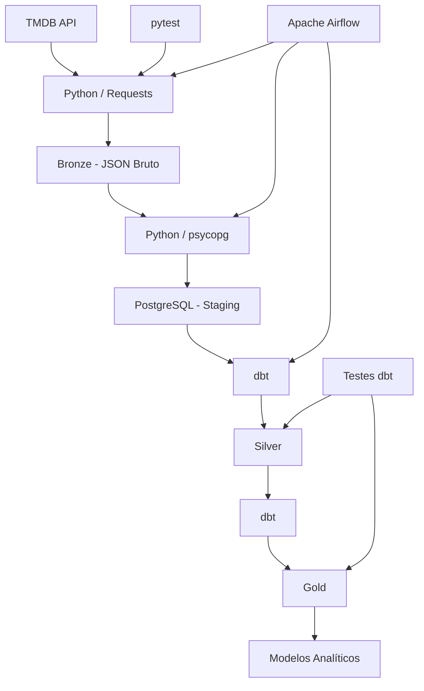
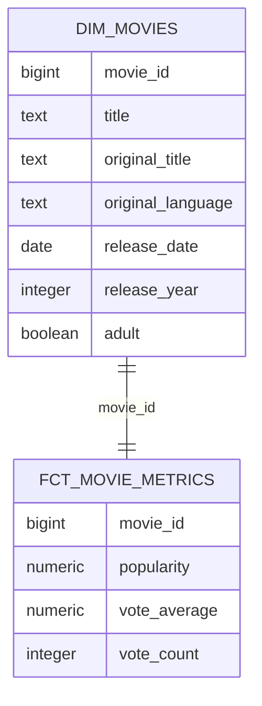

# 🎬 Movie Data Warehouse

<p align="center">
  Pipeline de Engenharia de Dados ponta a ponta para coleta, armazenamento, transformação, validação e orquestração de dados de filmes utilizando a API do TMDB.
</p>

<p align="center">
  
  
  
  
  
  
</p>

---

## 📌 Visão Geral

O **Movie Data Warehouse** é um projeto de Engenharia de Dados que simula um pipeline batch utilizado em um ambiente empresarial.

O pipeline coleta dados de filmes através da API do TMDB, armazena as respostas originais em uma camada Bronze, carrega os dados estruturados em PostgreSQL, realiza transformações através das camadas Silver e Gold utilizando dbt, executa testes de qualidade e orquestra todo o processo com Apache Airflow.

O projeto utiliza conceitos como:

- Ingestão de APIs
- Processamento batch
- ELT
- PostgreSQL
- Arquitetura Bronze / Silver / Gold
- Data Warehouse
- Modelagem dimensional
- Qualidade de dados
- Metadata de cargas
- Tratamento de falhas
- Testes automatizados
- Idempotência
- Orquestração de pipelines
- Containerização
- Git e GitHub

---

# 🏗️ Arquitetura



Fluxo simplificado:

```text
TMDB API
   ↓
Python / Requests
   ↓
Bronze JSON
   ↓
Python / psycopg
   ↓
PostgreSQL
   ↓
Staging
   ↓
dbt
   ↓
Silver
   ↓
dbt
   ↓
Gold
```

O Apache Airflow é responsável por orquestrar o pipeline completo.

---

# 🛠️ Tecnologias

## Linguagens

- Python
- SQL

## Engenharia de Dados

- PostgreSQL
- dbt Core
- Apache Airflow
- psycopg
- Requests

## Infraestrutura

- Docker
- Docker Compose
- Linux / Ubuntu

## Testes

- pytest
- dbt Tests
- monkeypatch
- tmp_path

## Desenvolvimento

- Git
- GitHub
- VS Code
- Python Virtual Environment

## Fonte de Dados

- TMDB API

---

# 🔄 Pipeline de Dados

O projeto utiliza uma arquitetura dividida em camadas:

```text
Fonte
  ↓
Bronze
  ↓
Staging
  ↓
Silver
  ↓
Gold
```

Cada camada possui uma responsabilidade diferente.

---

# 🥉 Camada Bronze

A camada Bronze armazena as respostas originais recebidas da API do TMDB.

Os dados são mantidos em JSON praticamente sem transformação.

Estrutura:

```text
data/
└── bronze/
    └── movies/
        └── YYYY-MM-DD/
            └── load_id/
                ├── movie_123.json
                ├── movie_456.json
                ├── movie_789.json
                └── metadata.json
```

Cada execução recebe um `load_id` único.

Isso permite identificar e rastrear diferentes cargas executadas pelo pipeline.

---

## 📋 Metadata das Cargas

Cada execução gera um arquivo:

```text
metadata.json
```

Exemplo:

```json
{
  "load_id": "uuid",
  "status": "SUCCESS",
  "started_at": "timestamp",
  "finished_at": "timestamp",
  "total_requested": 10,
  "total_success": 10,
  "total_failed": 0,
  "successful_ids": [],
  "failed_ids": []
}
```

Possíveis estados:

```text
RUNNING
SUCCESS
PARTIAL_SUCCESS
INTERRUPTED
FAILED
```

Isso permite acompanhar o resultado de cada execução.

---

# 🎬 Extração da API TMDB

O módulo `tmdb_client.py` é responsável pela comunicação com a API.

Principais funções:

```python
get_movie(movie_id)
get_popular_movies(page)
get_popular_movie_ids(limit)
```

Primeiro são consultados os filmes populares:

```text
/movie/popular
```

A resposta contém os IDs dos filmes.

Depois cada ID é utilizado para buscar os detalhes:

```text
/movie/{movie_id}
```

Fluxo:

```text
TMDB Popular Movies
        ↓
IDs dos filmes
        ↓
Busca individual
        ↓
JSON completo
        ↓
Bronze
```

---

# 🗃️ Camada Staging

Depois da Bronze, os JSONs são carregados no PostgreSQL.

Tabela principal:

```text
staging.movies
```

A Staging transforma os arquivos JSON em uma estrutura tabular, mas mantém os dados próximos da fonte original.

Campos utilizados:

```text
id
title
original_title
release_date
popularity
vote_average
vote_count
adult
original_language
```

A carga é feita através do Python utilizando `psycopg`.

```text
Bronze JSON
    ↓
Python
    ↓
psycopg
    ↓
staging.movies
```

---

# ♻️ Idempotência

A carga utiliza:

```sql
ON CONFLICT (id) DO NOTHING
```

Isso evita que filmes já existentes causem erro durante uma nova execução.

Exemplo:

```text
Filme já existe
      ↓
Conflito no ID
      ↓
Registro ignorado
      ↓
Pipeline continua
```

Dessa forma, o pipeline pode ser executado novamente sem quebrar devido a registros duplicados.

---

# 🥈 Camada Silver

A camada Silver é construída utilizando dbt.

Modelo principal:

```text
silver.movies
```

Nessa etapa os dados são limpos e padronizados.

Transformações utilizadas:

- Remoção de espaços desnecessários
- Padronização de idioma
- Criação do ano de lançamento
- Validação das notas dos filmes
- Padronização dos campos

Exemplo:

```sql
TRIM(title)
```

Normalização de idioma:

```sql
LOWER(original_language)
```

Criação do ano:

```sql
EXTRACT(YEAR FROM release_date)
```

Validação da avaliação:

```sql
CASE
    WHEN vote_average BETWEEN 0 AND 10 THEN vote_average
    ELSE NULL
END
```

---

# 🥇 Camada Gold

A camada Gold contém os modelos preparados para análise.

Modelos atuais:

```text
gold.dim_movies
gold.fct_movie_metrics
gold.movies_by_year
```

---

## 🎞️ dim_movies

Dimensão contendo informações descritivas dos filmes.

Campos:

```text
movie_id
title
original_title
original_language
release_date
release_year
adult
```

Grão:

```text
1 linha = 1 filme
```

---

## 📊 fct_movie_metrics

Tabela de fatos contendo métricas dos filmes.

Campos:

```text
movie_id
popularity
vote_average
vote_count
```

Grão:

```text
1 linha = métricas de 1 filme
```

A ligação com a dimensão é feita através de:

```text
movie_id
```

---

## 📈 movies_by_year

Modelo analítico que agrupa informações por ano de lançamento.

Métricas:

```text
release_year
total_movies
avg_vote_average
avg_popularity
total_votes
```

Esse modelo permite responder perguntas como:

- Quantos filmes foram lançados por ano?
- Qual a avaliação média dos filmes por ano?
- Qual a popularidade média?
- Quantos votos os filmes receberam?

---

# 🧱 Modelagem



---

# 🧪 Qualidade de Dados com dbt

O dbt é utilizado também para validar a qualidade dos dados.

Testes implementados:

## ID do filme

```text
NOT NULL
UNIQUE
```

## Título

```text
NOT NULL
```

## Idioma original

```text
NOT NULL
```

## Relacionamento entre fato e dimensão

Todo `movie_id` presente em:

```text
gold.fct_movie_metrics
```

deve existir em:

```text
gold.dim_movies
```

Isso ajuda a garantir integridade entre os modelos do Data Warehouse.

---

# 🧪 Testes Python

O projeto utiliza `pytest` para testar componentes Python.

Os testes verificam:

- Extração de filmes
- Extração em lote
- Criação dos arquivos Bronze
- Criação de metadata
- Execuções com sucesso
- Falhas parciais
- Respostas simuladas da API
- Escrita em diretórios temporários

---

## Monkeypatch

O `monkeypatch` é utilizado para substituir chamadas reais da API por respostas falsas durante os testes.

```text
TMDB real
   ↓
monkeypatch
   ↓
Resposta fake
```

Isso permite testar o código sem depender da internet ou da disponibilidade da API.

---

## tmp_path

O `tmp_path` do pytest cria diretórios temporários para os testes.

Dessa forma os testes não gravam arquivos dentro da Bronze real do projeto.

---

# 🌬️ Apache Airflow

O Apache Airflow é responsável pela orquestração do pipeline.

DAG:

```text
movie_dw_pipeline
```

Fluxo:

```text
extract_tmdb
      ↓
load_staging
      ↓
dbt_run
      ↓
dbt_test
```

---

## extract_tmdb

Responsável por:

```text
TMDB API
↓
Bronze JSON
```

---

## load_staging

Responsável por:

```text
Bronze
↓
PostgreSQL Staging
```

---

## dbt_run

Executa as transformações:

```text
Staging
↓
Silver
↓
Gold
```

---

## dbt_test

Executa os testes de qualidade dos modelos dbt.

---

O Airflow permite acompanhar:

- Execuções do pipeline
- Status das tarefas
- Logs
- Dependências entre tarefas
- Histórico
- Falhas
- Novas tentativas

O DAG também possui configuração de retry para lidar com falhas temporárias.

---

# 🐳 Docker

O PostgreSQL é executado em um container Docker.

Arquitetura local:

```text
Ubuntu
│
├── VS Code
│
├── Projeto Python
│   └── .venv
│
├── dbt Core
│
├── Apache Airflow
│
└── Docker
    └── PostgreSQL
```

O PostgreSQL utiliza:

```text
localhost:5432
```

---

# 🔐 Variáveis de Ambiente

Informações sensíveis ficam armazenadas no `.env`.

Exemplo:

```env
TMDB_API_TOKEN=

POSTGRES_HOST=localhost
POSTGRES_PORT=5432
POSTGRES_DB=movie_dw
POSTGRES_USER=
POSTGRES_PASSWORD=
```

O arquivo real:

```text
.env
```

não é enviado para o GitHub.

O repositório possui apenas:

```text
.env.example
```

sem credenciais reais.

---

# 📁 Estrutura do Projeto

```text
movie-data-warehouse/
│
├── airflow/
│   └── dags/
│       └── movie_dw_pipeline.py
│
├── data/
│   └── bronze/
│       └── movies/
│
├── docs/
│
├── movie_dw_dbt/
│   ├── analyses/
│   ├── macros/
│   │   └── generate_schema_name.sql
│   │
│   ├── models/
│   │   ├── sources.yml
│   │   │
│   │   ├── silver/
│   │   │   ├── movies.sql
│   │   │   └── schema.yml
│   │   │
│   │   └── gold/
│   │       ├── dim_movies.sql
│   │       ├── fct_movie_metrics.sql
│   │       ├── movies_by_year.sql
│   │       └── schema.yml
│   │
│   ├── seeds/
│   ├── snapshots/
│   ├── tests/
│   └── dbt_project.yml
│
├── src/
│   └── movie_dw/
│       ├── __init__.py
│       ├── db.py
│       ├── extract.py
│       ├── load_staging.py
│       └── tmdb_client.py
│
├── tests/
│   ├── test_extract.py
│   └── test_tmdb_client.py
│
├── docker-compose.yml
├── pytest.ini
├── requirements.txt
├── .env.example
├── .gitignore
└── README.md
```

---

# ⚙️ Configuração do Projeto

## 1. Clonar o repositório

```bash
git clone https://github.com/pedro-ramoss/movie-data-warehouse.git
cd movie-data-warehouse
```

---

## 2. Criar o ambiente Python

```bash
python3 -m venv .venv
source .venv/bin/activate
```

---

## 3. Instalar as dependências

```bash
pip install -r requirements.txt
```

---

## 4. Configurar o `.env`

Crie:

```text
.env
```

baseado no:

```text
.env.example
```

Configure:

```env
TMDB_API_TOKEN=

POSTGRES_HOST=localhost
POSTGRES_PORT=5432
POSTGRES_DB=movie_dw
POSTGRES_USER=
POSTGRES_PASSWORD=
```

---

## 5. Iniciar PostgreSQL

```bash
docker compose up -d
```

Verifique:

```bash
docker ps
```

---

# 🚀 Executando Manualmente

## Extração TMDB

```bash
PYTHONPATH=src python -m movie_dw.extract
```

---

## Carregar Staging

```bash
PYTHONPATH=src python -m movie_dw.load_staging
```

---

## Executar dbt

```bash
cd movie_dw_dbt
dbt run
```

---

## Executar testes dbt

```bash
dbt test
```

---

# 🧪 Executando Testes Python

Na raiz do projeto:

```bash
pytest -v
```

Exemplo:

```text
test_extract_movies PASSED
test_extract_movies_partial_failure PASSED
test_get_popular_movie_ids PASSED
test_get_popular_movie_ids_mock PASSED
```

---

# 🌬️ Executando com Airflow

Ative o ambiente do Airflow:

```bash
source ~/airflow-venv/bin/activate
```

Inicie:

```bash
airflow standalone
```

Abra no navegador:

```text
http://localhost:8080
```

Procure pelo DAG:

```text
movie_dw_pipeline
```

O Airflow executará:

```text
TMDB API
↓
Bronze
↓
Staging
↓
Silver
↓
Gold
↓
Testes
```

---

# 🔎 Comandos Úteis

## Ver containers

```bash
docker ps
```

## Entrar no PostgreSQL

```bash
docker exec -it movie_dw_postgres psql -U <usuario> -d movie_dw
```

## Executar dbt

```bash
cd movie_dw_dbt
dbt run
```

## Testar dbt

```bash
dbt test
```

## Executar pytest

```bash
pytest -v
```

## Ver alterações do Git

```bash
git status
```

---

# 📊 Exemplo de Consulta Analítica

```sql
SELECT
    release_year,
    total_movies,
    avg_vote_average,
    avg_popularity,
    total_votes
FROM gold.movies_by_year
ORDER BY release_year;
```

Essa consulta utiliza dados que já foram preparados pela camada Gold.

---

# 🎯 Conceitos Aplicados

```text
API Ingestion
Batch Processing
ELT
Bronze / Silver / Gold
PostgreSQL
Data Warehouse
Modelagem Dimensional
Data Quality
Metadata
Tratamento de Falhas
Idempotência
Orquestração
Testes Automatizados
Docker
Variáveis de Ambiente
Git
GitHub
```

---

# 🔄 Fluxo Completo

```text
                   ┌──────────────┐
                   │   TMDB API   │
                   └──────┬───────┘
                          │
                          ▼
                   ┌──────────────┐
                   │    Python    │
                   │   Requests   │
                   └──────┬───────┘
                          │
                          ▼
                   ┌──────────────┐
                   │    Bronze    │
                   │  JSON Bruto  │
                   └──────┬───────┘
                          │
                          ▼
                   ┌──────────────┐
                   │   psycopg    │
                   └──────┬───────┘
                          │
                          ▼
                   ┌──────────────┐
                   │   Staging    │
                   │  PostgreSQL  │
                   └──────┬───────┘
                          │
                          ▼
                   ┌──────────────┐
                   │     dbt      │
                   └──────┬───────┘
                          │
                          ▼
                   ┌──────────────┐
                   │    Silver    │
                   │ Dados Limpos │
                   └──────┬───────┘
                          │
                          ▼
                   ┌──────────────┐
                   │     Gold     │
                   │  Analytics   │
                   └──────────────┘

              Apache Airflow orquestra
                 todo o pipeline
```

---

# 👨‍💻 Autor

**Pedro Henrique**

Engenharia de Dados • Python • SQL • Dados & IA

[](https://www.linkedin.com/in/pedro-ramoss/)

[](https://github.com/pedro-ramoss)