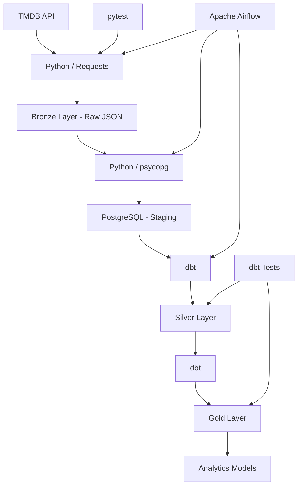
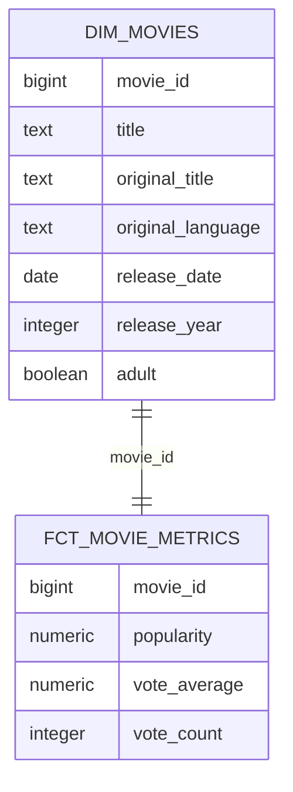

# 🎬 Movie Data Warehouse

<p align="center">
  End-to-end Data Engineering pipeline for collecting, storing, transforming, testing and orchestrating movie data from the TMDB API.
</p>

<p align="center">
  
  
  
  
  
  
</p>

---

## 📌 Overview

Movie Data Warehouse is an end-to-end batch Data Engineering project designed to simulate a production-oriented data pipeline.

The pipeline extracts movie data from the TMDB API, stores the original responses in a Bronze layer, loads structured data into PostgreSQL, transforms the data through Silver and Gold layers using dbt, validates data quality and orchestrates the complete workflow with Apache Airflow.

The project focuses on concepts commonly used in Data Engineering environments:

- API ingestion
- Batch processing
- Raw data storage
- ELT pipelines
- PostgreSQL
- Medallion architecture
- Data quality
- Dimensional modeling
- Pipeline orchestration
- Metadata tracking
- Failure handling
- Automated testing
- Idempotent loading
- Containerized infrastructure
- Version control

---

## 🏗️ Architecture



Simplified flow:

```text
TMDB API
   ↓
Python / Requests
   ↓
Bronze JSON
   ↓
Python / psycopg
   ↓
PostgreSQL
   ↓
Staging
   ↓
dbt
   ↓
Silver
   ↓
dbt
   ↓
Gold
```

Apache Airflow orchestrates the complete pipeline.

---

## 🛠️ Tech Stack

### Programming

- Python
- SQL

### Data Engineering

- PostgreSQL
- dbt Core
- Apache Airflow
- psycopg
- Requests

### Infrastructure

- Docker
- Docker Compose
- Linux / Ubuntu

### Testing

- pytest
- dbt data tests
- monkeypatch
- tmp_path

### Development

- Git
- GitHub
- VS Code
- Python virtual environments

### Data Source

- TMDB API

---

# 🔄 Data Pipeline

The pipeline follows a layered architecture.

```text
Source
  ↓
Bronze
  ↓
Staging
  ↓
Silver
  ↓
Gold
```

Each layer has a different responsibility.

---

## 🥉 Bronze Layer

The Bronze layer stores the original JSON responses returned by the TMDB API.

No business transformation is applied at this stage.

Example structure:

```text
data/
└── bronze/
    └── movies/
        └── YYYY-MM-DD/
            └── load_id/
                ├── movie_123.json
                ├── movie_456.json
                ├── movie_789.json
                └── metadata.json
```

Each execution receives a unique `load_id`.

This allows different ingestion runs to remain isolated and traceable.

### Load Metadata

Each load contains a `metadata.json` file with execution information.

Example:

```json
{
  "load_id": "uuid",
  "status": "SUCCESS",
  "started_at": "timestamp",
  "finished_at": "timestamp",
  "total_requested": 10,
  "total_success": 10,
  "total_failed": 0,
  "successful_ids": [],
  "failed_ids": []
}
```

Possible execution statuses:

```text
RUNNING
SUCCESS
PARTIAL_SUCCESS
INTERRUPTED
FAILED
```

This provides basic observability and execution tracking for the ingestion process.

---

# 🎬 TMDB Ingestion

The TMDB client is responsible for communicating with the external API.

Main functions include:

```python
get_movie(movie_id)
get_popular_movies(page)
get_popular_movie_ids(limit)
```

The pipeline first discovers movie IDs through the TMDB popular movies endpoint.

```text
/movie/popular
```

The returned movie IDs are then used to request detailed information individually.

```text
/movie/{movie_id}
```

Flow:

```text
TMDB Popular Movies
        ↓
Movie IDs
        ↓
Individual Movie Requests
        ↓
Raw JSON Files
```

---

## 🗃️ Staging Layer

The Staging layer is hosted in PostgreSQL.

The main table is:

```text
staging.movies
```

The purpose of Staging is to convert raw JSON data into a structured relational format while keeping the data close to its original source.

Current columns include:

```text
id
title
original_title
release_date
popularity
vote_average
vote_count
adult
original_language
```

The loading process is handled in Python using `psycopg`.

Flow:

```text
Bronze JSON
    ↓
Python
    ↓
psycopg
    ↓
staging.movies
```

---

## ♻️ Idempotent Loading

The Staging load uses PostgreSQL conflict handling:

```sql
ON CONFLICT (id) DO NOTHING
```

This prevents duplicated movie IDs from breaking repeated pipeline executions.

Example:

```text
Movie already exists
        ↓
Conflict detected
        ↓
Record ignored
        ↓
Pipeline continues
```

This allows the pipeline to be safely executed multiple times.

---

# 🥈 Silver Layer

The Silver layer is managed by dbt.

Main model:

```text
silver.movies
```

The Silver layer is responsible for cleaning and standardizing the Staging data.

Current transformations include:

- Removing unnecessary whitespace from titles
- Normalizing language codes
- Extracting release year
- Validating movie ratings
- Standardizing fields for downstream analytics

Example:

```sql
TRIM(title)
```

Language normalization:

```sql
LOWER(original_language)
```

Release year extraction:

```sql
EXTRACT(YEAR FROM release_date)
```

Rating validation:

```sql
CASE
    WHEN vote_average BETWEEN 0 AND 10 THEN vote_average
    ELSE NULL
END
```

---

# 🥇 Gold Layer

The Gold layer contains models designed for analytics and business consumption.

Current models include:

```text
gold.dim_movies
gold.fct_movie_metrics
gold.movies_by_year
```

---

## 🎞️ dim_movies

Movie dimension containing descriptive attributes.

Example fields:

```text
movie_id
title
original_title
original_language
release_date
release_year
adult
```

Grain:

```text
1 row = 1 movie
```

---

## 📊 fct_movie_metrics

Fact table containing movie metrics.

Example fields:

```text
movie_id
popularity
vote_average
vote_count
```

Grain:

```text
1 row = metrics for 1 movie
```

The fact table is connected to `dim_movies` through:

```text
movie_id
```

---

## 📈 movies_by_year

Analytical model aggregating movie metrics by release year.

Metrics include:

```text
release_year
total_movies
avg_vote_average
avg_popularity
total_votes
```

Example analytical questions that can be answered:

- How many movies were released each year?
- What is the average rating by year?
- How has movie popularity changed over time?
- How many votes were recorded for movies released in each year?

---

# 🧱 Data Model



---

# 🧪 Data Quality

Data quality checks are implemented with dbt.

Current tests include:

### Movie ID

```text
NOT NULL
UNIQUE
```

### Title

```text
NOT NULL
```

### Original Language

```text
NOT NULL
```

### Fact / Dimension Relationship

Every `movie_id` in:

```text
gold.fct_movie_metrics
```

must exist in:

```text
gold.dim_movies
```

This ensures referential integrity between the analytical models.

---

# 🧪 Python Testing

Python components are tested with pytest.

Current testing covers:

- Movie extraction
- Batch extraction
- Bronze file creation
- Metadata generation
- Successful loads
- Partial failures
- API mocking
- Temporary file systems

---

## Mocked API Responses

`monkeypatch` is used to replace real API calls during unit tests.

Example concept:

```text
Real TMDB Request
       ↓
monkeypatch
       ↓
Fake API Response
```

This allows tests to run without depending on the external TMDB API.

---

## Temporary Files

pytest's `tmp_path` fixture is used to create temporary directories during extraction tests.

This prevents automated tests from writing files into the real Bronze layer.

---

# 🌬️ Apache Airflow

Apache Airflow orchestrates the complete pipeline.

Current DAG:

```text
movie_dw_pipeline
```

Pipeline tasks:

```text
extract_tmdb
      ↓
load_staging
      ↓
dbt_run
      ↓
dbt_test
```

### Task Responsibilities

`extract_tmdb`

```text
TMDB API → Bronze JSON
```

`load_staging`

```text
Bronze JSON → PostgreSQL Staging
```

`dbt_run`

```text
Staging → Silver → Gold
```

`dbt_test`

```text
Run data quality validations
```

Airflow provides:

- Pipeline orchestration
- Task dependency management
- Execution history
- Task status monitoring
- Logs
- Manual pipeline execution
- Retry capabilities

The Airflow interface allows each pipeline execution to be visually monitored.

---

# 🐳 Docker

PostgreSQL runs inside a Docker container.

Current local architecture:

```text
Ubuntu
│
├── VS Code
│
├── Python Project
│   └── .venv
│
├── dbt Core
│
├── Apache Airflow
│
└── Docker
    └── PostgreSQL
```

The PostgreSQL container exposes:

```text
localhost:5432
```

The application connects to PostgreSQL using environment variables.

---

# 🔐 Environment Variables

Sensitive configuration is stored in `.env`.

Example:

```env
TMDB_API_TOKEN=

POSTGRES_HOST=localhost
POSTGRES_PORT=5432
POSTGRES_DB=movie_dw
POSTGRES_USER=
POSTGRES_PASSWORD=
```

The `.env` file is excluded from Git through `.gitignore`.

A safe template is provided through:

```text
.env.example
```

No API tokens or database passwords are committed to the repository.

---

# 📁 Project Structure

```text
movie-data-warehouse/
│
├── airflow/
│   └── dags/
│       └── movie_dw_pipeline.py
│
├── data/
│   └── bronze/
│       └── movies/
│
├── docs/
│
├── movie_dw_dbt/
│   ├── analyses/
│   ├── macros/
│   │   └── generate_schema_name.sql
│   ├── models/
│   │   ├── sources.yml
│   │   │
│   │   ├── silver/
│   │   │   ├── movies.sql
│   │   │   └── schema.yml
│   │   │
│   │   └── gold/
│   │       ├── dim_movies.sql
│   │       ├── fct_movie_metrics.sql
│   │       ├── movies_by_year.sql
│   │       └── schema.yml
│   │
│   ├── seeds/
│   ├── snapshots/
│   ├── tests/
│   └── dbt_project.yml
│
├── src/
│   └── movie_dw/
│       ├── __init__.py
│       ├── db.py
│       ├── extract.py
│       ├── load_staging.py
│       └── tmdb_client.py
│
├── tests/
│   ├── test_extract.py
│   └── test_tmdb_client.py
│
├── docker-compose.yml
├── pytest.ini
├── requirements.txt
├── .env.example
├── .gitignore
└── README.md
```

---

# ⚙️ Setup

## 1. Clone the repository

```bash
git clone https://github.com/pedro-ramoss/movie-data-warehouse.git
cd movie-data-warehouse
```

---

## 2. Create the Python environment

```bash
python3 -m venv .venv
source .venv/bin/activate
```

---

## 3. Install dependencies

```bash
pip install -r requirements.txt
```

---

## 4. Configure environment variables

Create:

```text
.env
```

based on:

```text
.env.example
```

Configure:

```env
TMDB_API_TOKEN=

POSTGRES_HOST=localhost
POSTGRES_PORT=5432
POSTGRES_DB=movie_dw
POSTGRES_USER=
POSTGRES_PASSWORD=
```

---

## 5. Start PostgreSQL

```bash
docker compose up -d
```

Verify:

```bash
docker ps
```

---

# 🚀 Running the Pipeline Manually

## Extract TMDB data

```bash
PYTHONPATH=src python -m movie_dw.extract
```

---

## Load Staging

```bash
PYTHONPATH=src python -m movie_dw.load_staging
```

---

## Run dbt transformations

```bash
cd movie_dw_dbt
dbt run
```

---

## Run dbt tests

```bash
dbt test
```

---

# 🧪 Running Python Tests

From the project root:

```bash
pytest -v
```

Example successful result:

```text
test_extract_movies PASSED
test_extract_movies_partial_failure PASSED
test_get_popular_movie_ids PASSED
test_get_popular_movie_ids_mock PASSED
```

---

# 🌬️ Running with Airflow

Activate the Airflow environment:

```bash
source ~/airflow-venv/bin/activate
```

Start Airflow:

```bash
airflow standalone
```

Open:

```text
http://localhost:8080
```

Locate:

```text
movie_dw_pipeline
```

The DAG executes:

```text
TMDB API
    ↓
Bronze
    ↓
Staging
    ↓
Silver
    ↓
Gold
    ↓
Data Tests
```

---

# 🔎 Useful Commands

### Check PostgreSQL container

```bash
docker ps
```

### Enter PostgreSQL

```bash
docker exec -it movie_dw_postgres psql -U <user> -d movie_dw
```

### Run dbt

```bash
cd movie_dw_dbt
dbt run
```

### Run dbt tests

```bash
dbt test
```

### Run Python tests

```bash
pytest -v
```

### Check Git status

```bash
git status
```

---

# 📊 Example Analytical Query

```sql
SELECT
    release_year,
    total_movies,
    avg_vote_average,
    avg_popularity,
    total_votes
FROM gold.movies_by_year
ORDER BY release_year;
```

This query consumes a Gold model already prepared for analytics.

---

# 🎯 Engineering Concepts Applied

This project applies several Data Engineering concepts in practice:

```text
API Ingestion
Batch Processing
ELT
Bronze / Silver / Gold Architecture
PostgreSQL
Data Modeling
Dimensional Modeling
Data Quality
Metadata Tracking
Failure Handling
Idempotency
Pipeline Orchestration
Automated Testing
Containerization
Environment Variables
Version Control
```

---

# 🔄 Complete Data Flow

```text
                  ┌──────────────┐
                  │   TMDB API   │
                  └──────┬───────┘
                         │
                         ▼
                  ┌──────────────┐
                  │    Python    │
                  │   Requests   │
                  └──────┬───────┘
                         │
                         ▼
                  ┌──────────────┐
                  │    Bronze    │
                  │   Raw JSON   │
                  └──────┬───────┘
                         │
                         ▼
                  ┌──────────────┐
                  │   psycopg    │
                  └──────┬───────┘
                         │
                         ▼
                  ┌──────────────┐
                  │   Staging    │
                  │  PostgreSQL  │
                  └──────┬───────┘
                         │
                         ▼
                  ┌──────────────┐
                  │     dbt      │
                  └──────┬───────┘
                         │
                         ▼
                  ┌──────────────┐
                  │    Silver    │
                  │ Cleaned Data │
                  └──────┬───────┘
                         │
                         ▼
                  ┌──────────────┐
                  │     Gold     │
                  │  Analytics   │
                  └──────────────┘

             Apache Airflow orchestrates
               the complete workflow
```

---

## 👨‍💻 Author

**Pedro Henrique**

Data Engineering • Python • SQL • Data & AI

[](https://www.linkedin.com/in/pedro-ramoss/)

[](https://github.com/pedro-ramoss)